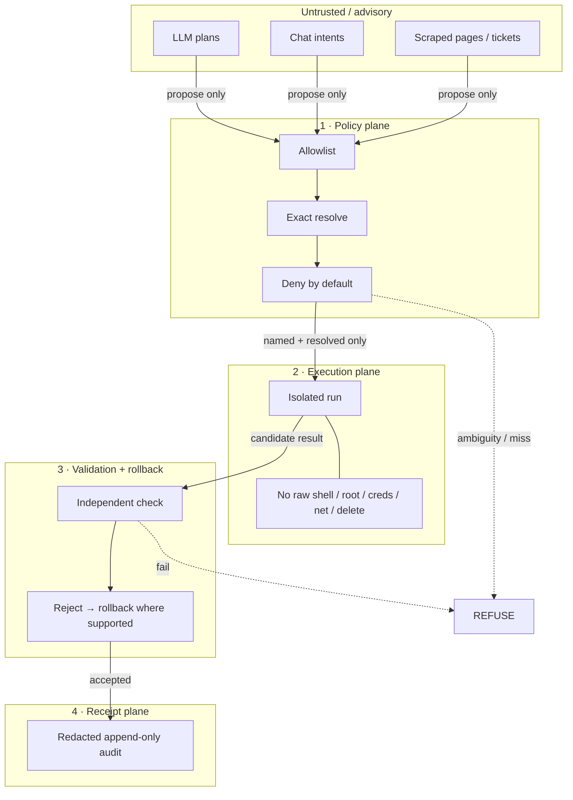

# Hermes Refuse

> **Status: design spec. No code yet.** This repository holds the design for Hermes Refuse: the problem, the threat model, the intended architecture and the boundaries. It contains no implementation. Code will land here when it exists.

**Specifies a macOS execution layer for agent-driven work that refuses any action that is ambiguous, over-broad or unaudited.**

[](https://github.com/marsojuji-cmyk/hermes-refuse/actions/workflows/ci.yml)
[](LICENSE)

**Affiliation:** Technical artifact under **Memory Utility Labs** (lab-first public face). Product context: intended for the AEGIS / AION stack.  
**Not affiliated with:** Quantify Labs’ Aegis Memory.

## What the design requires

Nothing here is enforced yet, because there is no code. These are the properties an implementation must have to count as Hermes Refuse:

- **Deny by default.** An operation runs only if it is named on an allowlist **and** resolves to exactly one target.
- **Fail closed at every stage.** An allowlist miss, an ambiguous resolve, missing isolation, a validation failure or a failed receipt write all end in refusal, never in "accept anyway".
- **No raw power on the agent path:** no unrestricted shell, root, credential access, unconstrained network or deletion authority.
- **Receipts for everything that runs.** The audit log is redacted and append-only, and a missing receipt counts as a failure.
- **No back door.** An optional Automator front end inherits the same policy.

## Read the spec

The design is §1–§6 below:
- Problem
- Threat model (assets, seven failure modes, what's out of scope)
- Trust boundaries (diagram)
- Capability model
- Control loop with the designed fail-closed table
- Non-goals

## How it fails (by design)

See the [control loop](#5-control-loop) table. Each stage's failure ends in **refuse**, or in **rollback, then refuse** where rollback is supported. That is the design target an implementation will be tested against. Today it is a specification, not a behaviour.

## Evidence

| Claim | Label |
|---|---|
| Public repo, Apache-2.0 | **Verified** |
| Fail-closed / allowlist / isolation / validation / rollback / receipts / Automator front end | **Design intent** (this document). No code exists to verify against |
| Implementation on `main` | **None**. The tree is README, LICENSE, SECURITY, CONTRIBUTING |
| Production deployment | **Not claimed** |

CI checks only that `README.md` and `LICENSE` exist and that no secret-shaped strings are committed.

## 1. Problem

Agents and automations that can act on a real Mac create a high-blast-radius control plane. A single ambiguous path, over-broad shell grant, or silent success without audit turns “helpful automation” into uncontrolled system change.

Hermes exists to make execution **narrow, inspectable, and fail-closed** — ambiguous, over-broad, or unaudited is refused.

## 2. Threat model

### Assets

| Asset | Why it matters |
|---|---|
| Host filesystem integrity | Automation must not silently rewrite or delete critical state |
| Credentials & secrets | Must never be readable or exfiltratable via execution path |
| Network identity | Must not open unconstrained egress under agent control |
| Privilege boundary | Root / TCC / SIP-adjacent power must stay human-gated |
| Auditability | After-the-fact reconstruction of what ran, on what, with what result |

### Adversaries / failure modes (design against)

1. **Over-broad agent intent** — model asks for “clean up” / “fix it” without a named, resolvable target.
2. **Ambiguous resolution** — path, app, or resource resolves to more than one candidate.
3. **Privilege escalation** — request implies root, credential access, or unrestricted shell.
4. **Silent mutation** — work appears to succeed with no receipt or with redaction failures that hide what changed.
5. **Replay / double-apply** — same action applied twice causes compounding damage.
6. **Confused deputy** — Automator or other front end used to bypass allowlist policy.
7. **Supply-chain / prompt injection** — untrusted content tries to coerce forbidden capabilities.

### Out of threat-model (for now)

- Full malware analysis of third-party binaries Hermes might invoke (future hardening).
- Guarantees against a human operator who already has admin and chooses to bypass Hermes.
- Cross-host orchestration or remote C2.

## 3. Trust boundaries



**Rule:** Nothing crosses a boundary unless the previous plane accepted it. Ambiguity or missing policy ⇒ **refuse**.

## 4. Capability model

### Allowed shape (design intent)

Operations that are:

- **Named** on an allowlist
- **Exactly resolved** to one target
- **Isolated** in execution
- **Independently validated**
- **Idempotent** where mutation is involved
- **Receipted** (redacted, append-only)

Optional human front end (Automator) must inherit the **same** policy — it is not a back door.

### Explicitly denied

| Denied | Rationale |
|---|---|
| Unrestricted shell | Infinite blast radius |
| Root / privilege escalation | Breaks host trust boundary |
| Credential read / use | Secrets must not enter agent path |
| Unconstrained network | Exfil + remote control risk |
| Deletion authority | Irreversible damage without separate, explicit policy |

## 5. Control loop

```
Intent → Allowlist match? → Exact resolve? → Isolated execute
      → Validate → (fail: rollback / refuse) → Append redacted receipt
```

| Stage | Designed fail-closed behavior (not implemented) |
|---|---|
| Allowlist miss | Refuse |
| Non-exact resolve | Refuse |
| Isolation unavailable | Refuse |
| Validation fail | Rollback if supported; never “accept anyway” |
| Receipt write fail | Treat as failure (no silent success) |

## 6. Non-goals

- General-purpose remote administration
- Memory-as-a-service product API (lab research ≠ this repo)
- Claiming AEGIS is production-complete
- Competing with or implying identity as Quantify Labs’ Aegis Memory

## Status

Design spec. No implementation and no release. When code lands, each "design requires" item above becomes a test, and the README moves to the tested-claims format.

## License

Apache License 2.0. See [`LICENSE`](./LICENSE).
